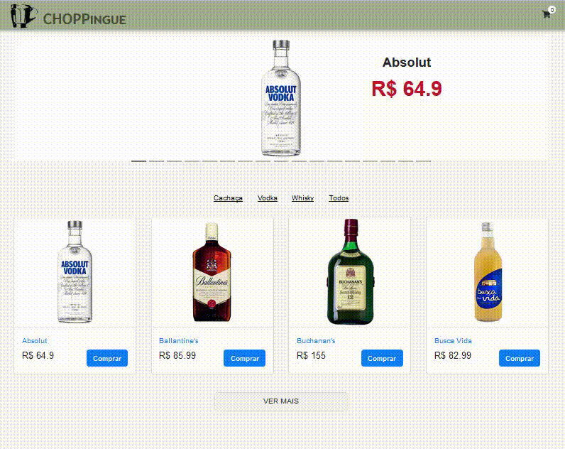

# CHOPPingue

### Requisitos

* Catálogo de produtos mais vendidos em carrossel,
* Listagem de produtos com paginação infinita,
* Listagem de produtos por categoria,
* Visualização de produtos,
* Carrinho de compras,
<<<<<<< HEAD
* Página de confirmação da compra.
=======
* Confirmação da compra.
>>>>>>> 7643649f771af1468501fecab55723ad4a3e7564

## Visualizando o aplicativo

  

## Autores

<!-- ALL-CONTRIBUTORS-LIST:START - Do not remove or modify this section -->
<!-- prettier-ignore -->
| [ <b>brenicio</b>](https://github.com/brenicio)  | [ <b>danylo-macelai</b>](https://github.com/danylo-macelai)   |  [ <b>Renato Araujo</b>](https://github.com/orenatoaraujo)  |
| :-------------------------------------------------------------------------------------------------------------------------------------------------------------------: | :----------------------------------------------------------------------------------------------------------------------------------------------------------------------: | :---------------------------------------------------------------------------------------------------------------------------------------------------------: |
<!-- ALL-CONTRIBUTORS-LIST:END -->
